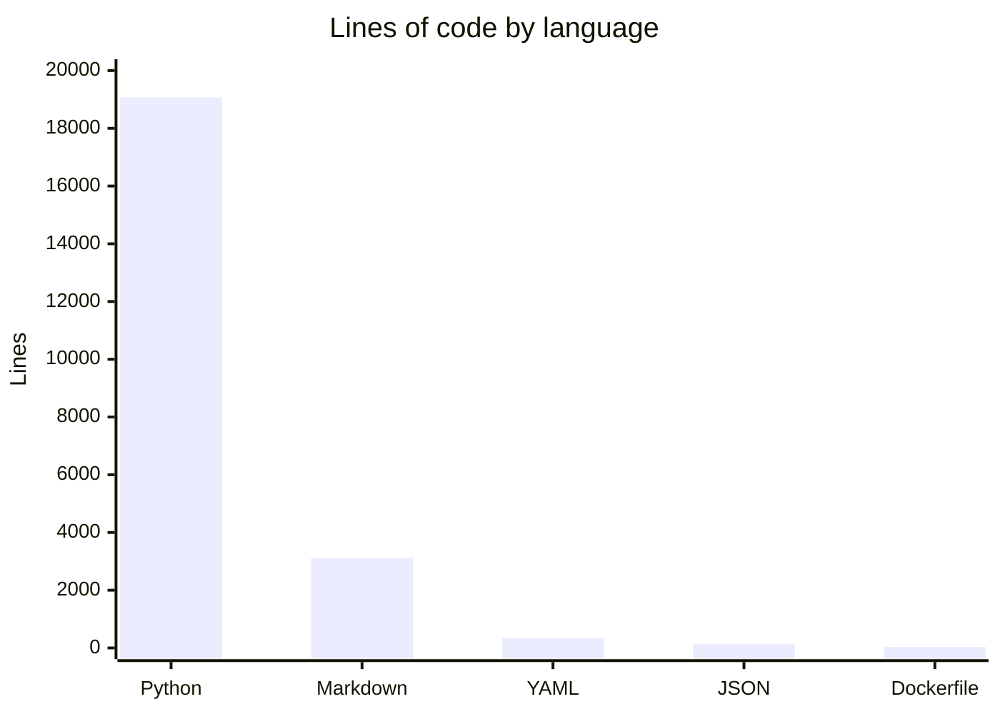

# By the numbers

Data collected on 2026-06-15.

## Size

| Category | Files | Lines |
|---|---|---|
| slopsearx/ (core) | 14 | 3,510 |
| engines/ | 49 | 6,708 |
| tests/ | 43 | 8,844 |
| **Total Python** | **107** | **19,073** |
| Markdown | 58 | 3,126 |
| YAML / Docker | 12 | ~350 |
| JSON | 2 | ~145 |
| Dockerfile | 1 | ~35 |

## Language breakdown

Python accounts for all functional source code. Markdown documents engines, architecture, and the wiki. YAML configures CI/CD and Kubernetes deployments. JSON stores configuration files. The Dockerfile defines the container image.

## Activity

| Metric | Value |
|---|---|
| Total commits | 76 |
| Commit period | Jun 8-15 2026 |
| Bot co-authored commits | 28 (37%) |
| Contributors (human) | 2 |

All 76 commits were made in June 2026. The project was scaffolded on June 8 and has seen continuous development since.

## Churn hotspots (last 90 days)

| File | Changes |
|---|---|
| `slopsearx/server.py` | 21 |
| `slopsearx/config.py` | 11 |
| `slopsearx/adapter.py` | 10 |
| `engines/__init__.py` | 9 |
| `pyproject.toml` | 7 |
| `engines/google.py` | 7 |
| `engines/duckduckgo.py` | 7 |
| `tests/test_server.py` | 6 |
| `slopsearx/formatter.py` | 6 |

## Complexity

Largest files by line count:

| File | Lines |
|---|---|
| tests/test_new_engines.py | 913 |
| tests/test_adapters.py | 700 |
| slopsearx/server.py | 690 |
| tests/test_fail_closed.py | 686 |
| tests/test_concurrency.py | 686 |
| slopsearx/config.py | 457 |
| slopsearx/adapter.py | 404 |
| tests/test_nvd.py | 403 |
| tests/test_formatter.py | 383 |

## Engine coverage

| Domain | Engine count |
|---|---|
| General / Web | 6 |
| Developer / Package Registries | 8 |
| Science & Research | 7 |
| Medical / Health | 4 |
| Security / Threat Intelligence | 17 |
| Finance / Economics | 2 |
| Media & Entertainment | 2 |
| Geography / GIS | 1 |
| Legal | 1 |
| **Total** | **48** |

Bot co-authorship (37%) is a lower bound on AI-assisted work. Inline AI tools like Copilot leave no trace in git history, so the actual AI contribution rate is likely higher.
