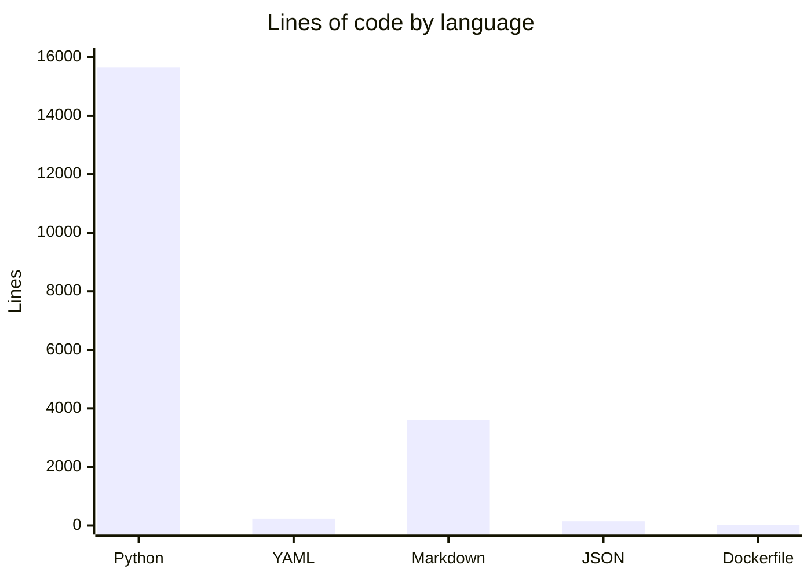

# By the numbers

Data collected on 2026-06-10.

## Size

| Category | Files | Lines |
|---|---|---|
| slopsearx/ (core) | 13 | 2,872 |
| engines/ | 49 | 6,674 |
| tests/ | 37 | 6,097 |
| **Total Python** | **~100** | **15,654** |
| YAML | 8 | ~230 |
| Markdown | 40 | ~3,600 |
| JSON | 2 | ~145 |
| Dockerfile | 1 | ~30 |

## Language breakdown

Note: Python accounts for all functional source code. YAML configures CI/CD and Kubernetes deployments. Markdown documents functionality (including the wiki). JSON stores configuration files. The Dockerfile defines the container image.

## Activity

| Metric | Value |
|---|---|
| Total commits | 50 |
| Commit period | Jun 8-10 2026 |
| Commits on Jun 8 | 12 |
| Commits on Jun 9 | 16 |
| Commits on Jun 10 | 22 |
| Bot-attributed commits | 3 (6%) |
| Contributors | 2 |

## Complexity

Largest files by line count:

| File | Lines |
|---|---|
| tests/test_new_engines.py | 913 |
| tests/test_adapters.py | 699 |
| slopsearx/server.py | 495 |
| slopsearx/config.py | 466 |
| tests/test_formatter.py | 353 |

## Engine coverage

| Domain | Engine count |
|---|---|
| General / Web | 6 |
| Developer / Package Registries | 8 |
| Science & Research | 7 |
| Medical / Health | 4 |
| Security / Threat Intelligence | 17 |
| Finance / Economics | 2 |
| Media & Entertainment | 3 |
| Geography / GIS | 1 |
| Legal | 1 |
| **Total** | **49** (48 adapters + `__init__.py`) |

## Ownership

Single primary contributor: Magnus Hedemark. Bot contributions from dependabot[bot].
