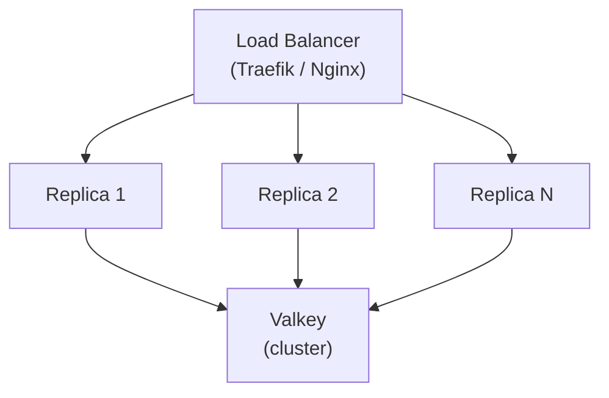

# Deployment

Active contributors: Magnus Hedemark

## Topology

SlopSearX runs as a single replica type behind a load balancer. Every replica loads all configured engines. All replicas are identical and interchangeable.



## Docker

### Pre-built images

Available from GitHub Container Registry:
- `ghcr.io/magnus919/slopsearx:latest` — latest main
- `ghcr.io/magnus919/slopsearx:unstable` — latest main (alias)
- `ghcr.io/magnus919/slopsearx:stable` — latest release
- `ghcr.io/magnus919/slopsearx:X.Y.Z` — specific version

### Quick start

```bash
docker run -d --name valkey valkey/valkey:8-alpine
docker run -d --name slopsearx -p 8080:8080 \
  -e VALKEY_URL=redis://valkey:6379/0 \
  --link valkey \
  ghcr.io/magnus919/slopsearx:latest
```

### Docker Compose

```yaml
# docker-compose.yml
services:
  slopsearx:
    build: .
    image: slopsearx:0.1.0
    ports:
      - "8080"
    env_file:
      - ../.env
    environment:
      - VALKEY_URL=redis://valkey:6379/0
    restart: unless-stopped

networks:
  default:
    name: groktocrawl_default
    external: true
```

## Kubernetes

Kustomize manifests in `k8s/`:

### Deployment

- 3 replicas (default)
- Resource limits: CPU/memory requests and limits
- Valkey URL via env var
- Config file via ConfigMap mount
- API keys via Secrets

### Service

- ClusterIP on port 8080
- Internal-only within the cluster

### HPA

- Min replicas: 3
- Max replicas: 100
- Target: 70% CPU utilization

Apply:
```bash
kubectl apply -k k8s/
```

## GroktoCrawl integration

Replace SearXNG in the GroktoCrawl stack:

```yaml
# docker-compose.yml (GroktoCrawl)
slopsearx:
  image: ghcr.io/magnus919/slopsearx:latest
  environment:
    - VALKEY_URL=redis://valkey:6379
    - ENGINE_BRAVE_API_KEY=${BRAVE_API_KEY}
  ports:
    - "8081:8080"
```

Update `SEARXNG_URL` in agent-svc to point to `slopsearx:8080`. The response format is backward compatible — no code changes needed in `searxng_client.py`.

## Environment variables

| Variable | Default | Description |
|---|---|---|
| `VALKEY_URL` | (none) | Valkey/Redis connection string. Required for caching, rate limiting, stats |
| `ENGINE_BRAVE_API_KEY` | (none) | Brave Search API key (primary engine) |
| `SENTRY_DSN` | (none) | Sentry DSN for error tracking |
| `MAX_CONCURRENT_ENGINES` | 10 | Max simultaneous outbound HTTP connections |
| `PER_CLIENT_REQUESTS` | 30 | Client request budget per window |
| `PER_CLIENT_WINDOW_SECONDS` | 60 | Sliding window for client rate limiting |
| `FAIL_CLOSED` | false | Deny requests when Valkey unreachable |
| `FAIL_CLOSED_GRACE_SECONDS` | 30 | Grace period before local fallback |
| `SEARCH_CACHE_TTL_SECONDS` | 3600 | Cache TTL (seconds) |
| `SEARCH_LOG_LEVEL` | INFO | Log level |
| `FEATURE_<NAME>` | false | Feature flag override |

## Image details

- **Base:** Python 3.12-slim
- **Size:** ~200MB
- **Cold start:** <2s
- **Port:** 8080
- **User:** Non-root (`slopsearx`)
- **Health check:** 30s interval, 5s timeout

## Key source files

| File | Description |
|---|---|
| `Dockerfile` | Production image build |
| `docker-compose.yml` | Docker Compose orchestration |
| `k8s/` | Kubernetes manifests |
| `docker/healthcheck.py` | Container health check script |
