# Engine implementations

Active contributors: Magnus Hedemark

## Purpose

SlopSearX ships with 48 built-in engine adapters. Each adapter lives in its own file under `engines/`, is registered via the `@register_engine` decorator, and subclasses either `EngineAdapter` (for API-based engines) or `ScrapeAdapter` (for HTML-scrape engines). Adding a new engine requires zero changes to the orchestrator.

## Key abstractions

Every adapter follows the same common pattern. The `search()` method receives a query string and optional params dict, executes the search against the backend, and returns an `AdapterResponse`. Errors are never raised — they are classified in `AdapterResponse.status` using the `EngineStatus` enum (OK, RATE_LIMITED, BLOCKED, ERROR, TIMEOUT). Rate limits are enforced through a shared Valkey-backed rate limiter injected at startup.

## Engine table — organized by domain

### General / Web

| Engine | File | Type | Categories | Auth | Notable behaviors |
|---|---|---|---|---|---|
| Brave | `engines/brave.py` | api | general, news, science, images | API key (`ENGINE_BRAVE_API_KEY`) | Rich JSON response with thumbnails; requires X-Subscription-Token header |
| DuckDuckGo | `engines/duckduckgo.py` | scrape | general, news | None | HTML form POST; `_is_challenge_page()` detection; CSS selector `.result` parsing |
| Google | `engines/google.py` | scrape | general, news | None | GET request; challenge detection; `div.g` CSS selector parsing |
| Hacker News | `engines/hackernews.py` | api | general, news | None | Algolia API integration; filters to stories only via `tags: "story"`, excludes comments |
| Reddit | `engines/reddit.py` | api | general, social, reddit:subreddit | None | Sub-category routing via `reddit:subreddit`; filters out NSFW content; respects Retry-After |
| Wikipedia | `engines/wikipedia.py` | api | general, science, reference | None | Two-stage pipeline: opensearch for titles, then rich_query for extracts + pageimages |

### Developer / Package Registries

| Engine | File | Type | Categories | Auth | Notable behaviors |
|---|---|---|---|---|---|
| Crates.io | `engines/crates.py` | api | general, it, reference, packages | None | Rust crate search via `/api/v1/crates`; paginated with `per_page`; recent_downloads scoring |
| Docker Hub | `engines/dockerhub.py` | api | general, it, reference, packages | None | Container image search; uses `/v2/repositories/library/` endpoint; star_count scoring |
| GitHub | `engines/github.py` | api | general, reference, github:code, github:issues, github:prs | Token (`ENGINE_GITHUB_TOKEN`) | Three sub-modes (code, issues, repositories) based on category routing |
| npm | `engines/npm.py` | api | general, it, reference, packages | None | npm registry JSON search at `/-/v1/search`; popularity-based scoring; publisher metadata |
| PyPI | `engines/pypi.py` | api | general, it, reference, packages | None | Two-stage: direct JSON lookup at `/pypi/{name}/json` then fallback to simple index HTML parsing |
| Repology | `engines/repology.py` | api | general, it, reference, packages | None | Multi-repository package status; aggregates version/status from many distros; newest-status scoring |
| RubyGems | `engines/rubygems.py` | api | general, it, reference, packages | None | Gem search via `/api/v1/search.json`; downloads-based scoring; author and description metadata |
| Stack Exchange | `engines/stackexchange.py` | api | general, reference, science, stackexchange:code, stackexchange:serverfault | Optional API key | Category-based site routing (stackoverflow, serverfault) |

### Science & Research

| Engine | File | Type | Categories | Auth | Notable behaviors |
|---|---|---|---|---|---|
| arXiv | `engines/arxiv.py` | api | general, science, reference | None | Atom XML feed parsing via `xml.etree.ElementTree`; rate-limited to 1 req/3s per arXiv ToS |
| HuggingFace | `engines/huggingface.py` | api | general, science, huggingface:datasets, huggingface:papers | Optional token | Three sub-modes (models, datasets, papers) based on category routing |
| Internet Archive | `engines/internetarchive.py` | api | reference, web:archive, historical | None | Domain queries route to Wayback CDX API; general queries use advancedsearch |
| OpenAlex | `engines/openalex.py` | api | general, science, reference | None | Scholarly works search; inverted index abstract reconstruction via `_reconstruct_abstract()` |
| Open Library | `engines/openlibrary.py` | api | general, books, reference | None | Book search via Open Library API; thumbnail from cover images; author_name and first_publish_year |
| Semantic Scholar | `engines/semanticscholar.py` | api | general, science, reference | Optional API key | Paper search with citation data, author metadata, arXiv cross-referencing via externalIds |
| UniProt | `engines/uniprot.py` | api | general, science, reference, biology, medical | None | Protein search via `/uniprotkb/search`; organism and gene metadata; primaryAccession key |

### Medical / Health

| Engine | File | Type | Categories | Auth | Notable behaviors |
|---|---|---|---|---|---|
| ClinicalTrials.gov | `engines/clinicaltrials.py` | api | general, medical, health, science | None | API v2 studies search at `/api/v2/studies`; paginated with `pageSize`; phase, condition, status metadata |
| openFDA | `engines/openfda.py` | api | general, medical, health, science, government | None | Drug labeling search at `/drug/label.json`; brand_name, generic_name, manufacturer, substance data |
| PubChem | `engines/pubchem.py` | api | general, science, reference, chemistry, medical | None | Two-stage: compound name search then CID detail lookup; IUPAC name, formula, molecular weight extraction |
| PubMed | `engines/pubmed.py` | api | general, science, reference, medical, health | None | Two-stage E-utilities: ESearch for PMIDs then ESummary for article details; author parsing |

### Security / Threat Intelligence

| Engine | File | Type | Categories | Auth | Notable behaviors |
|---|---|---|---|---|---|
| AbuseIPDB | `engines/abuseipdb.py` | api | security, threat-intel | API key (`ENGINE_ABUSEIPDB_API_KEY`) | IP reputation lookup; abuse confidence score; report category aggregation |
| AlienVault OTX | `engines/otx.py` | api | security, threat-intel | API key (`ENGINE_OTX_API_KEY`) | Multi-indicator (IP, hash, CVE, keyword) routing; pulse and indicator detail endpoint |
| Censys | `engines/censys.py` | api | it, security | API key + secret (`ENGINE_CENSYS_API_KEY`, `ENGINE_CENSYS_API_SECRET`) | Host search with HTTP basic auth; IP, location, services parsing; `_parse_hits()` |
| CRT.sh | `engines/crtsh.py` | api | it, security | None | Certificate Transparency log JSON; common_name, issuer, SANs parsing; free, no auth |
| CVE Program | `engines/cve.py` | api | it, security | None | MITRE CVE Services single-record endpoint; CVE JSON 5.2 format parsing; CVE ID detection only, no keyword search |
| DeHashed | `engines/dehashed.py` | api | security, threat-intel | API key (`ENGINE_DEHASHED_API_KEY`) | Credential leak search; `email:api_key` basic auth format; password truncation for safety |
| Exploit-DB | `engines/exploitdb.py` | scrape | security, exploit | None | EDB search page scraping via HTML table parsing; EDB-ID, CVE, platform, type extraction |
| FIRST EPSS | `engines/epss.py` | api | security, threat-intel | None | CVE exploit probability (0-1) from FIRST API; percentile and human-readable probability level |
| GreyNoise | `engines/greynoise.py` | api | security, threat-intel | Optional API key | IP noise vs targeted classification; community (no auth) and enterprise (API key) tier |
| Have I Been Pwned | `engines/hibp.py` | api | security, reference | API key (`ENGINE_HIBP_API_KEY`) | Breached account search via `/breachedaccount/{email}`; breach metadata (data classes, pwn count) |
| IntelX | `engines/intelx.py` | api | security, threat-intel | API key (`ENGINE_INTELX_API_KEY`) | Two-phase: search POST then result GET with 2s delay; darknet, paste, source code results |
| MITRE ATT&CK | `engines/mitreattack.py` | api | security, reference | None | Technique/group/software ID lookup (T####, G####, S####); HTML page scraping for details |
| NVD | `engines/nvd.py` | api | it, security | Optional API key | CVE + keyword search; CVE ID detection with direct lookup fallback; CVSS v4/v3.1/v3.0/v2 extraction |
| Shodan | `engines/shodan.py` | api | it, security | API key (`ENGINE_SHODAN_API_KEY`) | Internet device search; IP, port, service, vuln metadata; CVSS scoring in results |
| URLhaus | `engines/urlhaus.py` | api | security, threat-intel | None | Malware URL/payload/host tracking; auto-detection of URL, MD5, IP, hostname; POST endpoint |
| VirusTotal | `engines/virustotal.py` | api | security, malware | API key (`ENGINE_VIRUSTOTAL_API_KEY`) | Multi-engine detection search; file hash, URL, domain, IP scanning; `/api/v3/search` |
| VulnCheck | `engines/vulncheck.py` | api | security, threat-intel | API key (`ENGINE_VULNCHECK_API_KEY`) | CVE exploit intelligence; exploit_state, vendor_data, exploit_urls; Bearer token auth |

### Finance / Economics

| Engine | File | Type | Categories | Auth | Notable behaviors |
|---|---|---|---|---|---|
| FRED | `engines/fred.py` | api | general, finance, reference, economics | API key (`ENGINE_FRED_API_KEY`) | FRED series search at `/fred/series/search`; popularity-scored; observation_start, frequency, units |
| SEC EDGAR | `engines/edgar.py` | api | general, finance, reference | None | Corporate filings search via efts.sec.gov; form_type, CIK, description; Elasticsearch hits |

### Media & Entertainment

| Engine | File | Type | Categories | Auth | Notable behaviors |
|---|---|---|---|---|---|
| MusicBrainz | `engines/musicbrainz.py` | api | general, music, reference | None | Artist search via `/ws/2/artist/`; MBID, lifespan, country, type; User-Agent requirement |
| TMDB | `engines/tmdb.py` | api | general, movies, entertainment | API key (`ENGINE_TMDB_API_KEY`) | Multi-search (movie, TV, person); poster thumbnail support; vote_average scoring; release/first_air_date |

### Geography / GIS

| Engine | File | Type | Categories | Auth | Notable behaviors |
|---|---|---|---|---|---|
| Nominatim | `engines/nominatim.py` | api | general, geography, reference | None | OpenStreetMap geocoding; display_name, type, category, OSM type/ID; importance scoring; User-Agent policy |

### Legal

| Engine | File | Type | Categories | Auth | Notable behaviors |
|---|---|---|---|---|---|
| Oyez | `engines/oyez.py` | api | general, reference, legal | None | SCOTUS cases list API at `/cases`; sorted by decision_date desc; term, href, decision_date metadata |

## Class hierarchy

The adapter class hierarchy has two base classes and 48 concrete adapters:

```mermaid
classDiagram
    class EngineAdapter {
        +name: str
        +display_name: str
        +env_prefix: str
        +engine_type: str
        +categories: list[str]
        +search(query, params)* AdapterResponse
        +health() EngineStatus
        +warmup() None
        +shutdown() None
    }
    class ScrapeAdapter {
        +engine_type: str
        +request_headers: dict
        +timeout_ms: int
        +health() EngineStatus
    }
    class BraveAdapter
    class WikipediaAdapter
    class GitHubAdapter
    class HuggingFaceAdapter
    class InternetArchiveAdapter
    class OpenAlexAdapter
    class StackExchangeAdapter
    class ArxivAdapter
    class HackerNewsAdapter
    class SemanticScholarAdapter
    class RedditAdapter
    class CratesAdapter
    class DockerHubAdapter
    class NpmAdapter
    class PyPIAdapter
    class RepologyAdapter
    class RubyGemsAdapter
    class OpenLibraryAdapter
    class UniProtAdapter
    class ClinicalTrialsAdapter
    class OpenFDAAdapter
    class PubChemAdapter
    class PubMedAdapter
    class AbuseIPDBAdapter
    class OTXAdapter
    class CensysAdapter
    class CrtShAdapter
    class CVEAdapter
    class DeHashedAdapter
    class EPSSAdapter
    class ExploitDBAdapter
    class GreyNoiseAdapter
    class HIBPAdapter
    class IntelXAdapter
    class MitreAttackAdapter
    class NVDAdapter
    class ShodanAdapter
    class URLhausAdapter
    class VirusTotalAdapter
    class VulnCheckAdapter
    class FredAdapter
    class EdgarAdapter
    class MusicBrainzAdapter
    class TMDBAdapter
    class NominatimAdapter
    class OyezAdapter
    class DuckDuckGoAdapter
    class GoogleAdapter

    EngineAdapter <|-- ScrapeAdapter
    EngineAdapter <|-- BraveAdapter
    EngineAdapter <|-- WikipediaAdapter
    EngineAdapter <|-- GitHubAdapter
    EngineAdapter <|-- HuggingFaceAdapter
    EngineAdapter <|-- InternetArchiveAdapter
    EngineAdapter <|-- OpenAlexAdapter
    EngineAdapter <|-- StackExchangeAdapter
    EngineAdapter <|-- ArxivAdapter
    EngineAdapter <|-- HackerNewsAdapter
    EngineAdapter <|-- SemanticScholarAdapter
    EngineAdapter <|-- RedditAdapter
    EngineAdapter <|-- CratesAdapter
    EngineAdapter <|-- DockerHubAdapter
    EngineAdapter <|-- NpmAdapter
    EngineAdapter <|-- PyPIAdapter
    EngineAdapter <|-- RepologyAdapter
    EngineAdapter <|-- RubyGemsAdapter
    EngineAdapter <|-- OpenLibraryAdapter
    EngineAdapter <|-- UniProtAdapter
    EngineAdapter <|-- ClinicalTrialsAdapter
    EngineAdapter <|-- OpenFDAAdapter
    EngineAdapter <|-- PubChemAdapter
    EngineAdapter <|-- PubMedAdapter
    EngineAdapter <|-- AbuseIPDBAdapter
    EngineAdapter <|-- OTXAdapter
    EngineAdapter <|-- CensysAdapter
    EngineAdapter <|-- CrtShAdapter
    EngineAdapter <|-- CVEAdapter
    EngineAdapter <|-- DeHashedAdapter
    EngineAdapter <|-- EPSSAdapter
    EngineAdapter <|-- ExploitDBAdapter
    EngineAdapter <|-- GreyNoiseAdapter
    EngineAdapter <|-- HIBPAdapter
    EngineAdapter <|-- IntelXAdapter
    EngineAdapter <|-- MitreAttackAdapter
    EngineAdapter <|-- NVDAdapter
    EngineAdapter <|-- ShodanAdapter
    EngineAdapter <|-- URLhausAdapter
    EngineAdapter <|-- VirusTotalAdapter
    EngineAdapter <|-- VulnCheckAdapter
    EngineAdapter <|-- FredAdapter
    EngineAdapter <|-- EdgarAdapter
    EngineAdapter <|-- MusicBrainzAdapter
    EngineAdapter <|-- TMDBAdapter
    EngineAdapter <|-- NominatimAdapter
    EngineAdapter <|-- OyezAdapter
    ScrapeAdapter <|-- DuckDuckGoAdapter
    ScrapeAdapter <|-- GoogleAdapter
    ScrapeAdapter <|-- ExploitDBAdapter
```

## How it works

### Common adapter pattern

1. **search() flow** — read config (base_url, timeout, api_key), build request parameters, send HTTP request via httpx, measure latency, parse response into `SearchResult` list, return `AdapterResponse`.
2. **Error handling** — every adapter catches `httpx.TimeoutException`, HTTP status errors (429 for rate limiting, 403/503 for blocking), and generic exceptions. All are classified into `EngineStatus` and returned in `AdapterResponse`.
3. **Rate limiting integration** — the rate limiter is injected into each adapter at construction time. Adapters call `self.rate_limiter.acquire()` before making requests. The rate limiter is Valkey-backed and distributed across all replicas.

### Unique patterns by engine

#### General / Web
- **BraveAdapter** — requires an API key set via `ENGINE_BRAVE_API_KEY`. Uses `X-Subscription-Token` header for authentication. Parses `web.results` from the JSON response, extracting thumbnails from the nested `thumbnail.src` field.
- **DuckDuckGoAdapter** — a `ScrapeAdapter` subclass. Sends an HTML form POST to `https://html.duckduckgo.com/html/`. The `_is_challenge_page()` method detects CAPTCHA walls by checking for known indicators in the response body. Parses results using CSS selector `.result` with lxml.
- **GoogleAdapter** — a `ScrapeAdapter` subclass. Sends a GET request to `https://www.google.com/search` with stealth headers. Challenge detection checks for reCAPTCHA and "unusual traffic" indicators. Parses organic results using the `div.g` CSS selector.
- **HackerNewsAdapter** — integrates with Algolia's HN search API at `https://hn.algolia.com/api/v1/search`. Filters to stories only by passing `tags: "story"`, deliberately excluding comments.
- **RedditAdapter** — routes to subreddit-specific or global search via `reddit:subreddit` category. Filters out NSFW content (over_18 flag). Uses Reddit's public JSON API with `raw_json=1` parameter.
- **WikipediaAdapter** — two-stage pipeline. Stage 1 calls the `opensearch` API action to resolve the query to page titles. Stage 2 calls the `query` API action with `prop=extracts|pageimages` to fetch rich content (summaries, thumbnails) for each resolved title.

#### Developer / Package Registries
- **CratesAdapter** — searches Rust crates via `https://crates.io/api/v1/crates`. Uses `recent_downloads` for relevance scoring with `total_downloads` as fallback.
- **DockerHubAdapter** — searches container images via `https://hub.docker.com/v2/repositories/library/`. Paginated with `page_size` parameter. Scores by `star_count` with `pull_count` fallback.
- **GitHubAdapter** — selects its API endpoint based on category routing: `github:code` routes to `/search/code`, `github:issues` or `github:prs` routes to `/search/issues`, and everything else routes to `/search/repositories`. Requires `ENGINE_GITHUB_TOKEN`. Returns HTTP 422 for code searches without sufficient qualifiers, handled gracefully as empty results.
- **NpmAdapter** — searches npm registry via `https://registry.npmjs.org/-/v1/search`. Scores by search API popularity score. Extracts publisher username and version metadata.
- **PyPIAdapter** — two-stage design. Stage 1 attempts a direct JSON lookup at `/pypi/{name}/json` for exact package name matches. Stage 2 falls back to scraping the `/simple/` HTML index page using lxml, matching package names by normalized substring. Each matched package is then enriched via the JSON API.
- **RepologyAdapter** — aggregates package status across many distro repositories. Parses a map of project name to package list and extracts version, repo, and status (newest, outdated, etc.). Scores 1.0 for newest-status packages.
- **RubyGemsAdapter** — searches gems via `https://rubygems.org/api/v1/search.json`. Scores by download count. Extracts gem name, version, info, authors, and download stats.
- **StackExchangeAdapter** — maps sub-categories to Stack Exchange sites: `stackexchange:code` routes to stackoverflow, `stackexchange:serverfault` routes to serverfault, and the default is stackoverflow. Converts Unix timestamps to ISO 8601 for the `published_date` field.

#### Science & Research
- **ArxivAdapter** — parses Atom XML feeds using `xml.etree.ElementTree` with namespace `http://www.w3.org/2005/Atom`. Rate-limited to 1 request per 3 seconds as required by arXiv's Terms of Service. Strips arXiv IDs from the atom `<id>` element and constructs paper URLs.
- **HuggingFaceAdapter** — routes to one of three HuggingFace API endpoints based on category: `huggingface:datasets` routes to `/api/datasets`, `huggingface:papers` routes to `/api/papers`, and the default routes to `/api/models`. Parses model metadata (pipeline_tag, library_name, downloads, likes) into rich result content.
- **InternetArchiveAdapter** — detects whether the query looks like a domain name (e.g., `example.com`) and routes domain queries to the Wayback CDX API for snapshot data. General queries use the `advancedsearch.php` endpoint for books, audio, video, and other archived media.
- **OpenAlexAdapter** — searches scholarly works via `https://api.openalex.org/works`. Reconstructs abstracts from OpenAlex's inverted index format (`{"word": [positions], ...}`) using the `_reconstruct_abstract()` helper. Sorts results by `cited_by_count:desc`.
- **OpenLibraryAdapter** — searches books via `https://openlibrary.org/search.json`. Extracts author names, first publish year, ISBN, and cover images. Scores by ratings count. Provides thumbnail URLs via covers.openlibrary.org.
- **SemanticScholarAdapter** — searches papers via the Semantic Scholar graph API. Requests rich fields (title, url, abstract, citationCount, publicationDate, externalIds, authors). Builds content from abstract, author names (truncated to 3 with "et al."), citation count, and arXiv cross-reference.
- **UniProtAdapter** — searches proteins via `https://rest.uniprot.org/uniprotkb/search`. Extracts primaryAccession, protein description, organism scientific name, and gene name. Constructs entry URLs.

#### Medical / Health
- **ClinicalTrialsAdapter** — queries the ClinicalTrials.gov API v2 at `/api/v2/studies`. Uses `query.term`, `pageSize`, `format=json`, and `sort=@relevance` parameters. Extracts NCT ID, brief title, overall status, phase, and conditions. Constructs study detail URLs.
- **OpenFDAAdapter** — searches FDA drug labeling via `https://api.fda.gov/drug/label.json`. Extracts brand name, generic name, manufacturer, substance, purpose, and indications. Builds content from nested `openfda` object and root-level fields.
- **PubChemAdapter** — two-stage compound search. Stage 1 looks up the query as a compound name via `/compound/name/{query}/cids/JSON`. Stage 2 fetches full compound details via `/compound/cid/{cids}/JSON`. Extracts IUPAC name, molecular formula, and molecular weight.
- **PubMedAdapter** — two-stage NCBI E-utilities search. Stage 1 calls `esearch.fcgi` with `db=pubmed` to get matching PMIDs. Stage 2 calls `esummary.fcgi` with the comma-separated PMID list to fetch article details (title, source, pubdate, authors).

#### Security / Threat Intelligence
- **AbuseIPDBAdapter** — IP address reputation lookup. Uses regex to extract IP from query. Sends `X-API-KEY` in headers. Parses abuse confidence score, total reports, last reported date, ISP, domain, and usage type.
- **AlienVault OTXAdapter** — automatically detects indicator type (IP, hash, CVE, or keyword) and routes to the appropriate endpoint. Supports both indicator detail and pulse keyword search. Uses `X-OTX-API-KEY` header.
- **CensysAdapter** — uses HTTP basic auth with API ID and secret. Searches hosts via `/api/v2/hosts/search`. Parses IP, location (ASN, country, city), and services (name:port).
- **CRT.shAdapter** — certificate transparency log search. Sends GET with `?output=json` and `?q=` parameters. Parses common name, issuer, SANs, validity dates, and serial number from the JSON array response.
- **CVEAdapter (MITRE)** — single-record CVE lookup from CVE Services API. Only responds to queries containing a CVE ID pattern. Parses JSON 5.2 format containers (CNA and ADP), extracts descriptions, references, and CVSS metrics.
- **DeHashedAdapter** — credential leak search using `email:api_key` basic auth format. Parses email, username, password (truncated), hashed password, IP, database name, and breach source.
- **ExploitDBAdapter** — a `ScrapeAdapter` subclass. Uses lxml HTML table parsing on `https://www.exploit-db.com/search`. Extracts EDB ID, CVE references, author, platform, exploit type, and date from table rows.
- **EPSSAdapter (FIRST)** — CVE exploit probability scoring. Queries `https://api.first.org/data/v1/epss`. Only responds to CVE ID patterns. Returns score (0-1), percentile, and human-readable probability level.
- **GreyNoiseAdapter** — IP noise vs targeted classification. Supports community tier (no auth) and enterprise tier (API key). Auto-detects IP from query. Returns classification, noise/RIOT flags, tags, and last seen date.
- **HIBPAdapter** — breached account search. Uses `hibp-api-key` header. Auto-detects email via regex. Returns breach name, domain, breach date, pwn count, data classes, and description.
- **IntelXAdapter** — two-phase search: POST to `/intelligent/search` to initiate, then GET `/intelligent/result` after a 2-second delay for results. Returns darknet, pastebin, document, source code, and forum records.
- **MITRE ATT&CKAdapter** — ID-based lookup for techniques (T####), groups (G####), and software (S####). Uses lxml HTML scraping on `https://attack.mitre.org`. Parses title, description, tactics/platforms from HTML elements.
- **NVDAdapter** — CVE and keyword search. Detects CVE IDs for direct lookup or falls back to keyword search. Supports optional API key for higher rate limits. Extracts CVSS v4/v3.1/v3.0/v2 metrics, CWE weaknesses, and references.
- **ShodanAdapter** — internet device search. Sends API key as query parameter. Parses IP, port, org, hostnames, product, version, CVSS score, and CVE vuln references.
- **URLhausAdapter** — auto-detects query type (URL, MD5 hash, IP, hostname) and routes to appropriate POST endpoint. Returns url_id, threat, tags, file_type, url_status, and first/last seen dates.
- **VirusTotalAdapter** — multi-engine detection search via `/api/v3/search`. Uses `x-apikey` header. Parses last_analysis_stats (malicious/suspicious/total), type_description, and reputation.
- **VulnCheckAdapter** — CVE exploit intelligence. Only responds to CVE ID patterns. Uses Bearer token auth. Returns exploit_state, date_added, vendor_data, exploit_urls, and CPE entries.

#### Finance / Economics
- **FREDAdapter** — searches Federal Reserve economic data series. Sorts by popularity descending. Extracts series ID, title, observation start, frequency, units, seasonal adjustment, and notes.
- **EdgarAdapter** — searches SEC corporate filings via Elasticsearch-backed `https://efts.sec.gov/LATEST/search-index`. Parses display names, form type, description, filed date, and CIK.

#### Media & Entertainment
- **MusicBrainzAdapter** — searches music artists via the MusicBrainz API. Requires proper User-Agent header per the MusicBrainz policy. Extracts artist name, MBID, type, country, and lifespan begin date.
- **TMDBAdapter** — multi-search across movies, TV, and people. Requires `ENGINE_TMDB_API_KEY`. Parses media_type for result classification, provides poster thumbnail URLs via image.tmdb.org.

#### Geography / GIS
- **NominatimAdapter** — geocodes place names via the OpenStreetMap Nominatim API. Uses JSON format with address details. Extracts display name, type, category, OSM type/ID, and importance score. Requires User-Agent header per the Nominatim usage policy.

#### Legal
- **OyezAdapter** — searches Supreme Court cases via the Oyez API at `/cases`. Sorts by decision date descending. Extracts case name, term, decision date, and Oyez ID for URL construction.

## Key source files

- All files in `engines/` directory (48 files)
- `slopsearx/adapter.py` — base classes `EngineAdapter` and `ScrapeAdapter`
- `slopsearx/ratelimit.py` — distributed rate limiting shared by all engines

## See also

- [Output formatters](output-formatters.md) — how engine results are serialized
- [Search result types](../primitives/search-result.md) — the `SearchResult` dataclass
- [System architecture](../overview/architecture.md) — request flow through engines
- [Glossary](../overview/glossary.md) — project-specific terms
