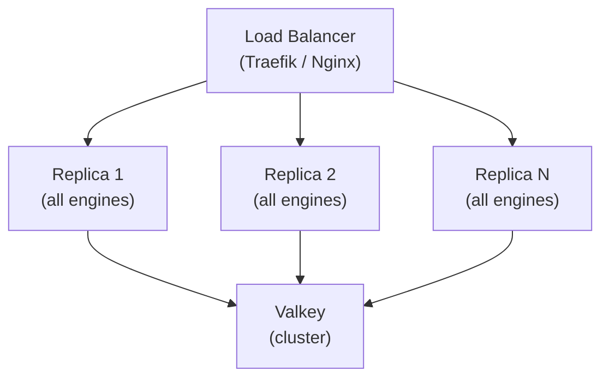
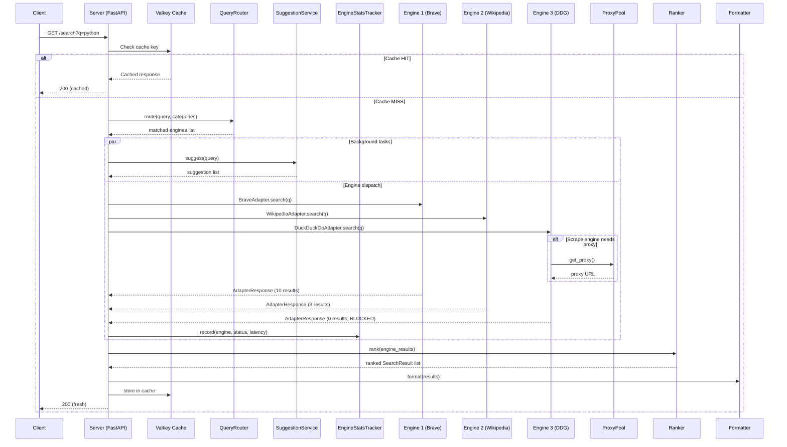

# System architecture

SlopSearX runs as a single replica type behind a load balancer. Every replica loads all configured engines and communicates with Valkey for shared state. All replicas are interchangeable.

## Request flow

When a client sends `GET /search?q=...`, the following happens inside one replica:

### Step by step

1. **Query normalization** — the raw query string is normalized into a tuple of `(query, language, pageno, categories, safesearch)`
2. **Cache lookup** — Valkey is checked with a SHA-256 key derived from the normalized tuple. A cache hit returns immediately (~2ms)
3. **Query routing** — on cache miss, the QueryRouter analyzes the query and selects only relevant engines based on topic matching and category filters
4. **Concurrent dispatch + suggestions** — matched engines run concurrently via `asyncio.gather()` alongside the SuggestionService background task. Each engine adapter call has a 3-second timeout. Scrape adapters may request a proxy from the ProxyPool before issuing HTTP requests
5. **Result collection** — each adapter returns an `AdapterResponse` with results and a status. Engines that error out return classified errors, not exceptions. The EngineStatsTracker records per-engine success/failure metrics in Valkey after each dispatch
6. **Merging and ranking** — the `PresenceRanker` normalizes URLs (strips tracking params), deduplicates by normalized URL, and scores results by how many engines returned them
7. **Caching** — the merged result set is stored in Valkey with category-aware TTL
8. **Formatting** — the response is serialized as JSON (SearXNG-compatible) or YAML+Markdown

## Engine tiers

SlopSearX has two tiers of reliability:

- **Tier 1 (always-available)** — API-based engines like Brave and Wikipedia. These use structured JSON APIs, have SLAs, and are reliable
- **Tier 2 (quality multipliers)** — scrape-based engines like DuckDuckGo and Google. These send HTTP requests with stealth headers and parse HTML. They break frequently due to CAPTCHA walls, IP bans, and HTML structure changes

A CAPTCHA block or IP ban on a scrape engine never blocks the response. The failing engine is reported in `unresponsive_engines` and omitted from results. The response always returns HTTP 200 with whatever results are available.

## Core subsystems

| Subsystem | `slopsearx/` file | Purpose |
|---|---|---|
| Adapter interface | `adapter.py` | Base classes `EngineAdapter` and `ScrapeAdapter`, `@register_engine` decorator, engine registry |
| Merging and ranking | `merger.py` | `PresenceRanker`, URL normalization, deduplication, metadata helpers |
| Configuration | `config.py` | Three-layer config (defaults + YAML file + env vars), `Config` dataclass |
| Caching | `cache.py` | Valkey-backed response cache with category-aware TTL |
| Rate limiting | `ratelimit.py` | Distributed rate limiting with Valkey sliding window, backpressure propagation |
| Metrics | `metrics.py` | OpenMetrics-compatible counters, gauges, and histograms (stdlib only) |
| Server | `server.py` | FastAPI application, `/search`, `/health`, `/metrics`, `/config` endpoints |
| Formatters | `formatter.py` | SearXNG JSON formatter and YAML+Markdown agent-native formatter |
| QueryRouter | `router.py` | Topic-based query routing that dispatches to relevant engines only |
| EngineStatsTracker | `stats.py` | Per-engine quality telemetry stored in Valkey (success/failure counts, latency) |
| SuggestionService | `suggest.py` | Background search query suggestions from engine suggest APIs |
| ProxyPool | `proxypool.py` | Configurable proxy rotation infrastructure for scrape-based adapters |

## Language breakdown

The project is 100% Python 3.12+ with supporting YAML, JSON, and Markdown configuration files.

| Language | Files | Lines |
|---|---|---|
| Python | ~100 | 15,654 |
| YAML | 8 | ~230 |
| Markdown | 40 | ~3,600 |
| JSON | 2 | ~145 |
| Dockerfile | 1 | ~30 |

The `slopsearx/` core library is ~2,870 lines across 13 files, the `engines/` directory is ~6,670 lines across 49 files (48 adapters + `__init__.py`), and `tests/` is ~6,100 lines across 37 files.

## Key dependencies

- **FastAPI** — HTTP framework for the REST API
- **httpx** — async HTTP client for engine API calls and HTML scraping
- **lxml** — HTML parsing for scrape-based engines (DuckDuckGo, Google)
- **Valkey** — in-memory data store for caching, rate limiting, and engine stats (Redis-compatible)
- **uvicorn** — ASGI server
- **PyYAML** — YAML config parsing and YAML+Markdown output formatting
