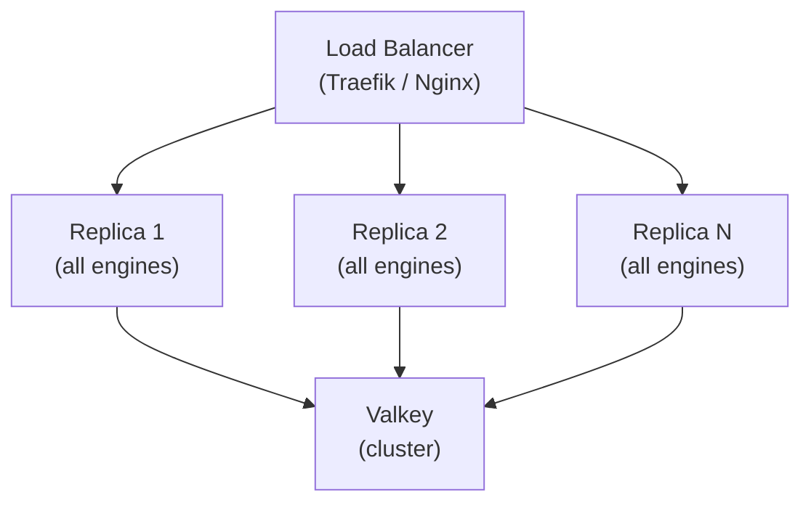
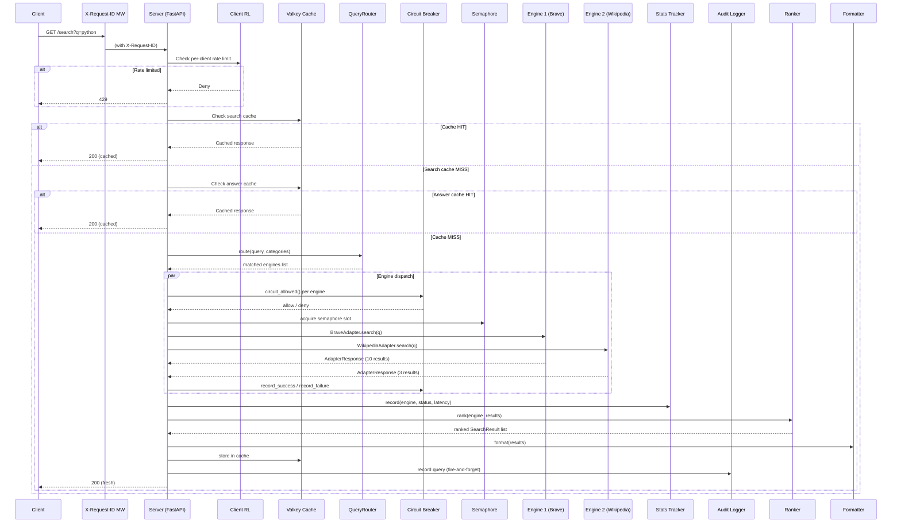

# System architecture

SlopSearX runs as a single replica type behind a load balancer. Every replica loads all configured engines and communicates with Valkey for shared state. All replicas are interchangeable.

## Request flow

When a client sends `GET /search?q=...`, the following happens inside one replica:

### Step by step

1. **X-Request-ID middleware** — every request gets a UUIDv4 trace ID (or preserves an incoming one). The ID is stored in `request.state.request_id` and echoed in the response header
2. **Query normalization** — the raw query string is lowercased, stripped, and normalized into a tuple of `(query, language, pageno, categories, safesearch)`
3. **Per-client rate limiting** — the client IP is checked against its request budget via `ValkeySlidingWindow`. Exceeded budgets return HTTP 429 before any engine work. When `FAIL_CLOSED=true`, Valkey unavailability denies requests during a grace period, then falls back to an in-process token bucket
4. **Search cache lookup** — Valkey is checked with a SHA-256 key derived from the normalized tuple. A cache hit returns immediately
5. **Answer cache lookup** — if the search cache misses, the broader answer-level cache is checked (query only, no language/safesearch)
6. **Negative cache check** — if either cached entry has an `_error` sentinel, HTTP 503 is returned without dispatching
7. **Query routing** — the QueryRouter analyzes the query and selects relevant engines based on topic matching and category filters. Unscoped queries without topic matches are restricted to Tier 1 (broad) engines
8. **Circuit breaker check** — each target engine's circuit breaker (threshold: 5 consecutive errors, timeout: 300s) is checked. Open circuits skip dispatch
9. **Concurrent dispatch** — allowed engines run concurrently via `asyncio.gather()`, bounded by a semaphore (`MAX_CONCURRENT_ENGINES`, default 10). Each engine has a 3-second timeout. Unhandled exceptions are captured by Sentry (if configured) and classified as errors
10. **Result collection** — each adapter returns an `AdapterResponse` with results and a status. Circuit breaker state is updated (record_success/record_failure). The EngineStatsTracker records per-engine quality telemetry
11. **Merging and ranking** — the `PresenceRanker` normalizes URLs, deduplicates by normalized URL, and scores results by how many engines returned them. Results are sorted by `(tier, -score)`
12. **Formatting** — the response is serialized as JSON (SearXNG-compatible, 23 fields preserved) or YAML+Markdown (agent-native)
13. **Caching** — the merged result set is stored in both the search cache and answer cache with category-aware TTL (3600s general, 300s news)
14. **Audit trail** — the query is recorded in a Valkey stream with dispatch statistics (fire-and-forget)

## Engine tiers

SlopSearX has two tiers of reliability:

- **Tier 1 (always-available)** — six broad, general-purpose engines (Brave, DuckDuckGo, Google, Wikipedia, Stack Exchange, Reddit). These form the primary result set in unscoped searches
- **Tier 2 (quality multipliers)** — all 42 specialized engines (science, packages, security, finance, media, etc.). Results are surfaced below Tier 1 in unscoped searches, keeping top results focused without losing domain coverage

All new engines are Tier 2 by default. Tier 1 classification requires maintainer approval.

## Core subsystems

| Subsystem | `slopsearx/` file | Purpose |
|---|---|---|
| Adapter interface | `adapter.py` | Base classes `EngineAdapter` and `ScrapeAdapter`, `@register_engine` decorator, engine registry, circuit breaker, URL sanitization |
| API server | `server.py` | FastAPI application, `/search`, `/health`, `/metrics`, `/config` endpoints, per-client rate limiting, semaphore-bounded concurrency, two-tier engine selection |
| Configuration | `config.py` | Three-layer config (defaults + YAML file + env vars), `Config` dataclass, feature flags |
| Query router | `router.py` | Topic-based query routing dispatching to relevant engines only |
| Merging and ranking | `merger.py` | `PresenceRanker`, URL normalization, deduplication, metadata helpers |
| Caching | `cache.py` | Two-level Valkey-backed response cache (search + answer), negative caching, query normalization |
| Rate limiting | `ratelimit.py` | Distributed rate limiting with Valkey sliding window, fail-closed mode with local fallback, backpressure propagation |
| Metrics | `metrics.py` | OpenMetrics-compatible counters, gauges, and histograms (stdlib only, no prometheus-client dependency) |
| Logging | `logging.py` | structlog-based structured JSON logging, optional Sentry error tracking |
| Middleware | `middleware.py` | X-Request-ID propagation and structured logging context |
| Formatters | `formatter.py` | SearXNG JSON formatter and YAML+Markdown agent-native formatter |
| Engine stats | `stats.py` | Per-engine quality telemetry stored in Valkey |
| Audit trail | `audit.py` | Durable audit log of every search query in Valkey streams |
| Suggestions | `suggest.py` | Background search query suggestions from Brave Suggest + DDG fallback |
| Proxy pool | `proxypool.py` | Configurable proxy rotation with failure tracking and escalating cooloff |

## Language breakdown

The project is 100% Python 3.12+ with supporting YAML, JSON, and Markdown configuration files.

| Language | Files | Lines |
|---|---|---|
| Python | ~100 | ~19,000 |
| YAML | 8 | ~230 |
| Markdown | 40+ | ~3,600 |
| JSON | 2 | ~145 |
| Dockerfile | 1 | ~30 |

The `slopsearx/` core library is ~3,000 lines across 15 files, the `engines/` directory is ~6,700 lines across 49 files (48 adapters + `__init__.py`), and `tests/` is ~6,100 lines across 37 files.

## Key dependencies

- **FastAPI** — HTTP framework for the REST API
- **httpx** — async HTTP client for engine API calls and HTML scraping
- **lxml** — HTML parsing for scrape-based engines (DuckDuckGo, Google)
- **Valkey** — in-memory data store for caching, rate limiting, engine stats, and audit trails (Redis-compatible)
- **uvicorn** — ASGI server
- **PyYAML** — YAML config parsing and YAML+Markdown output formatting
- **structlog** — structured JSON logging
- **sentry-sdk** — optional error tracking (activated by `SENTRY_DSN` env var)
