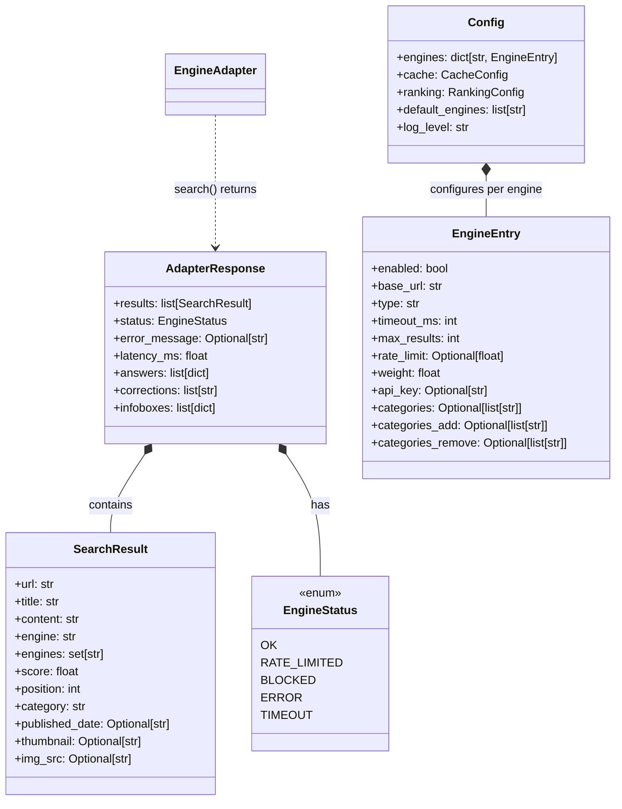

# Search result types

Active contributors: Magnus Hedemark

## Purpose

Defines the core data types used throughout SlopSearX. These types are the contract between every layer of the system: engine adapters produce them, the merger consumes and transforms them, and formatters serialize them.

## Key abstractions

### SearchResult

Defined in `slopsearx/adapter.py`. The internal normalized result dataclass, decoupled from any wire format.

```python
@dataclass
class SearchResult:
    url: str
    title: str
    content: str
    engine: str                    # primary engine name
    engines: set[str]              # all engines that returned this result
    score: float                   # normalized relevance score
    position: int                  # position within the engine's results
    category: str                  # SearXNG-compatible category tag
    published_date: Optional[str]  # ISO 8601
    thumbnail: Optional[str]       # thumbnail image URL
    img_src: Optional[str]         # source image URL
```

Fields `engine` and `engines` serve different purposes: `engine` identifies the primary engine that produced the result, while `engines` is a set that accumulates all engines that returned the same normalized result during deduplication.

Note `img_src` and `thumbnail` fields: both are Optional[str]. `thumbnail` holds the URL for a small thumbnail image, while `img_src` holds the URL for the full-size source image. Most adapters populate only one of these.

### AdapterResponse

Defined in `slopsearx/adapter.py`. The canonical return type for every adapter's `search()` method.

```python
@dataclass
class AdapterResponse:
    results: list[SearchResult]
    status: EngineStatus
    error_message: Optional[str] = None
    latency_ms: float = 0.0
    answers: list[dict] = field(default_factory=list)
    corrections: list[str] = field(default_factory=list)
    infoboxes: list[dict] = field(default_factory=list)
```

This is the contract that enforces "adapters never raise exceptions." Every possible error state is captured in the `status` field, with a human-readable `error_message` for debugging.

The three extended fields (`answers`, `corrections`, `infoboxes`) have default empty lists. They are populated by adapters that support them and are aggregated at the merger level into the final JSON response:

- **answers** — list of dicts with direct answer content (e.g., knowledge panel answers). Each dict typically has `url` and `content` keys.
- **corrections** — list of suggested query correction strings (e.g., "Did you mean: ...").
- **infoboxes** — list of structured info box dicts with rich metadata for entities (e.g., Wikipedia infobox data).

### EngineStatus

Defined in `slopsearx/adapter.py`. Standardized engine health and error classification.

```python
class EngineStatus(enum.Enum):
    OK = "ok"
    RATE_LIMITED = "rate_limited"
    BLOCKED = "blocked"
    ERROR = "error"
    TIMEOUT = "timeout"
```

The `BLOCKED` status is used for CAPTCHA walls, IP bans, and HTTP 403/503 responses from scrape engines. `RATE_LIMITED` is used for HTTP 429 responses or when the local rate limiter refuses a request. `TIMEOUT` is used for `httpx.TimeoutException`. `ERROR` is the catch-all for unexpected failures. All five values (OK, RATE_LIMITED, BLOCKED, ERROR, TIMEOUT) are represented.

### EngineEntry

Defined in `slopsearx/config.py`. Per-engine configuration entry with all parameters.

```python
@dataclass
class EngineEntry:
    enabled: bool = True
    base_url: str = ""
    type: str = "api"                    # "api" | "scrape" | "structured"
    timeout_ms: int = 5_000
    max_results: int = 10
    rate_limit: Optional[float] = None   # requests per second
    weight: float = 1.0
    api_key: Optional[str] = None
    categories: Optional[list[str]] = None       # full override
    categories_add: Optional[list[str]] = None    # append
    categories_remove: Optional[list[str]] = None # suppress
    proxy_pool: Optional[str] = None
    scrape_proxy_url: Optional[str] = None
```

The `EngineEntry` dataclass supports three category override mechanisms: `categories` (full replacement), `categories_add` (append to self-declared), and `categories_remove` (suppress from self-declared). The `api_key` field has a `__post_init__` hook that reads from environment variables as fallback.

### Config

Defined in `slopsearx/config.py`. Top-level configuration dataclass.

```python
@dataclass
class Config:
    engines: dict[str, EngineEntry]
    cache: CacheConfig
    ranking: RankingConfig
    default_engines: list[str]
    log_level: str
```

The `Config` dataclass is populated by the layered configuration loader (`load_config()` in `slopsearx/config.py`), which merges built-in defaults, an optional YAML config file, and environment variable overrides.

## Class diagram



## Data flow through the system

1. **Configuration layer** — `load_config()` in `slopsearx/config.py` builds a `Config` object containing `EngineEntry` instances for each enabled engine. Each engine adapter is instantiated with its `EngineEntry` config.
2. **Execution layer** — each engine adapter's `search()` method returns an `AdapterResponse` containing a list of `SearchResult` and an `EngineStatus`. The merger in `slopsearx/merger.py` collects all `AdapterResponse` objects, deduplicates by normalized URL, and produces a single ranked list of `SearchResult`.
3. **Formatting layer** — formatters in `slopsearx/formatter.py` consume the ranked `SearchResult` list and produce either SearXNG JSON or YAML+Markdown output.

## Key source files

- `slopsearx/adapter.py` — SearchResult, AdapterResponse, EngineStatus
- `slopsearx/config.py` — EngineEntry, Config, CacheConfig, RankingConfig

## See also

- [Output formatters](../features/output-formatters.md) — how SearchResult is serialized
- [Engine implementations](../features/engine-implementations.md) — how adapters produce SearchResult and AdapterResponse
- [System architecture](../overview/architecture.md) — end-to-end request flow
